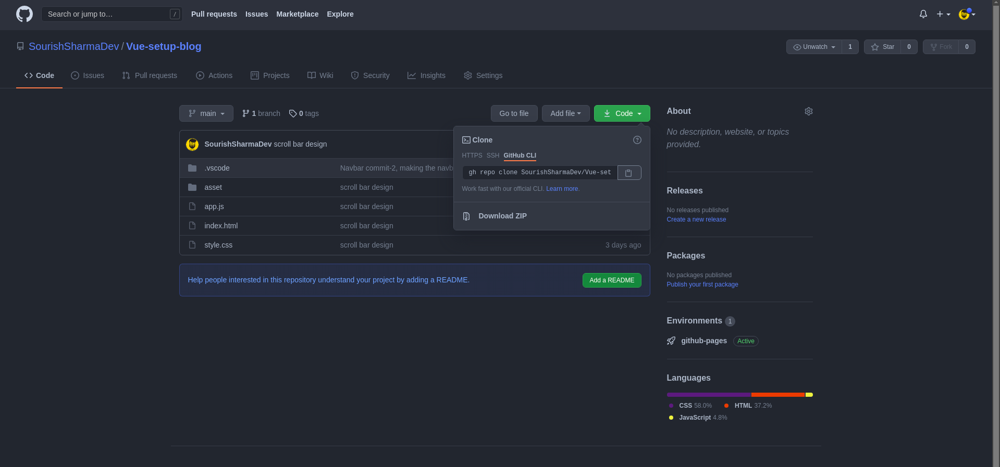

<!-- PROJECT SHIELDS -->
<!--
*** I'm using markdown "reference style" links for readability.
*** Reference links are enclosed in brackets [ ] instead of parentheses ( ).
*** See the bottom of this document for the declaration of the reference variables
*** for contributors-url, forks-url, etc. This is an optional, concise syntax you may use.
*** https://www.markdownguide.org/basic-syntax/#reference-style-links
-->

<!-- PROJECT LOGO -->
<br />
<p align="center">
  <a href="https://sourishsharmadev.github.io/Vue-setup-blog/">
    
  </a>

  <h3 align="center">Modern Blog Templete</h3>

  <p align="center">
    Blog Templete made with HTML, CSS and a bit of Javascript
    <br />
    <br />
    <a href="https://sourishsharmadev.github.io/Vue-setup-blog/">View Demo</a>
    ||
    <a href="https://github.com/SourishSharmaDev/Vue-setup-blog/issues">Report Bug</a>
    ||
    <a href="https://github.com/SourishSharmaDev/Vue-setup-blog/issues">Advice Features</a>
  </p>
</p>

## Instalation

If you have git installed, then clone it :

```
gh repo clone SourishSharmaDev/Vue-setup-blog
```

or install the Zip files:


## Usage

Download the files and start editing! :D
